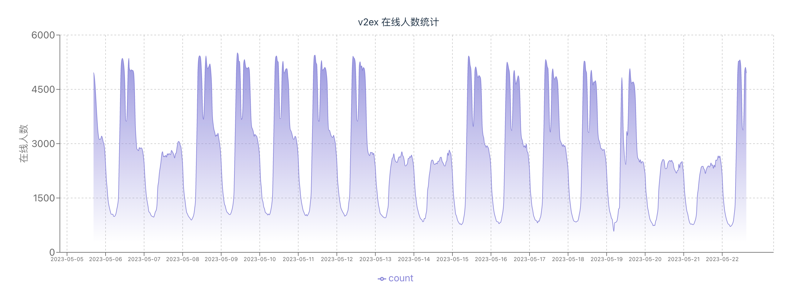

# v2ex 论坛在线人数分析

目标: 分析v2ex论坛用户在线规律，科学发帖让更多人可以看到。

## 用法

你可以在 [CodeSandbox](https://codesandbox.io/p/github/moonrailgun/v2ex-online-statistics/master) 中直接运行本项目。以在线预览图表。

## 数据集

数据来源于 v2ex 底部的在线人数统计，每半小时采样一次。

数据集记录在 [./src/assets/dataset.json](./src/assets/dataset.json)

## 总结

- v2ex 用户普遍在工作日上论坛，双休日人数是工作日人数的一半
- v2ex 用户工作日的人数普遍是从上午9点开始，到下午9点开始会有一个断崖式的下跌
- 工作日的下午1点会有一个断崖式的下跌，看来大部分人都有午休的好习惯。
- 凌晨1点到7点是论坛人数最少的时候，但依旧有1000人左右在坚守。可能是因为是海外同学？
- 在双休日的在线人数比较均匀，波动不大。看来到了双休日选择午休的人不多了(毕竟在家里午休可是花的自己的时间！bushi)
- 双休日的在线普遍后移，用户在线时间由工作日的上午9点到下午9点后移到了上午10点到下午12点。看来大家在周末有更多的精力上网冲浪了。

## 结论

从整体数据上来看，大部分都是上班时间浏览 v2ex 摸鱼的，下班就不看了。少部分忠实的用户在周末反而会加大上网冲浪的强度。

另外时差党在v2ex社区的比例不低
